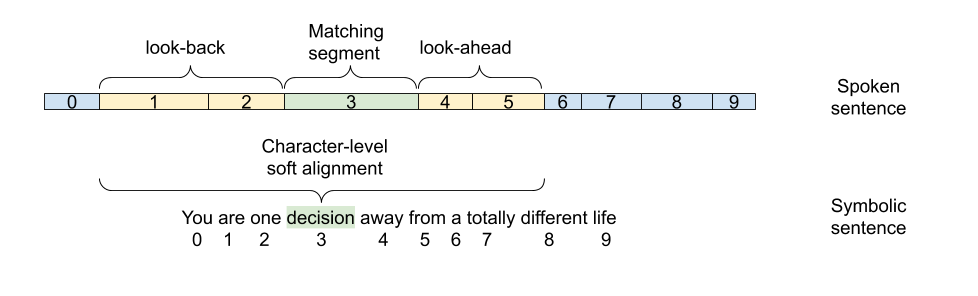
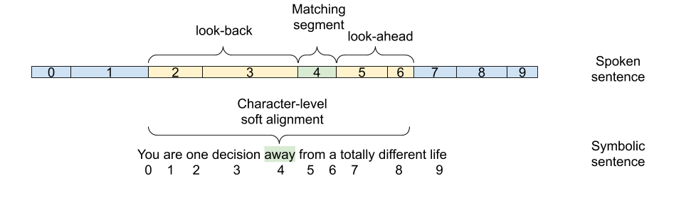

# Taris
Transformer-based online speech recognition system with TensorFlow 2.0

### About

Taris is an approach to online speech recognition described in [1].
The system dynamically segments a spoken sentence by learning to count the number of spoken words therein.
Decoding is conditioned on a dynamic window of segments, instead of an entire utterance as in the original sequence to sequence architecture.

This repository also maintains the audio-visual alignment and fusion strategy AV Align [2,3] currently implemented with the Transformer stacks instead of the original recurrent networks [4]


### Overview
To decode online, Taris learns to count the number of words in a spoken sentence. As we show in [1], 
this task facilitates the partitioning of the speech input into segments that can be decoded eagerly.
However, a longer context is needed in order to match the accuracy of an offline system.

The figure below illustrates an example where the decoder uses two look-back and look-ahead segments
to condition all the characters within a given word in the output modality.



Once all the characters in `decision` are processed and the system predicts a blank space token,
the attention distribution advances by one more segment, and is used in computing audio context vectors
for every character in the next word `away`.





### How to use

##### Launch scripts
The script `run_audio.py` launches audio-only experiments.\
Relevant system flags are:

+ `--transformer_online_encoder (default: False)`
+ `--transformer_encoder_lookahead (default: 11)`
+ `--transformer_encoder_lookback (default: 11)`
+ `--transformer_online_decoder (default: False)`
+ `--transformer_decoder_lookahead (default: 5)`
+ `--transformer_decoder_lookback (default: 5)`

The script `run_audiovisual.py` launches audio-visual experiments implementing the AV Align strategy with a Transformer,
reproducing the work in [4]. By default, the Action Unit regularisation loss, controlled by the `--au_loss` flag,
is set to `False`.

##### Data preparation

This project currently depends on the Tensorflow 1.x based [AVSR-tf1](https://github.com/georgesterpu/avsr-tf1)
repository to generate the input .tfrecord files. We are in the process of porting the data preparation pipeline
to a lighter library to simplify the experimentation with Taris.


### References

[1] Learning to Count Words in Fluent Speech enables Online Speech Recognition\
George Sterpu, Christian Saam, Naomi Harte\
Under review\
[[arXiv](https://arxiv.org/abs/2006.04928)]

[2] How to Teach DNNs to Pay Attention to the Visual Modality in Speech Recognition\
George Sterpu, Christian Saam, Naomi Harte\
IEEE/ACM Transactions on Audio, Speech, and Language Processing, 2020\
[ [pdf accepted version](https://raw.githubusercontent.com/georgesterpu/georgesterpu.github.io/master/papers/taslp2020.pdf) ] [[IEEE version](https://ieeexplore.ieee.org/document/9035650)]

[3] Attention-based Audio-Visual Fusion for Robust Automatic Speech Recognition\
George Sterpu, Christian Saam, Naomi Harte\
in ICMI 2018\
[[arXiv](https://arxiv.org/abs/1809.01728)]

[4] Should we hard-code the recurrence concept or learn it instead ?
Exploring the Transformer architecture for Audio-Visual Speech Recognition \
George Sterpu, Christian Saam, Naomi Harte\
Under review\
[[arXiv](https://arxiv.org/abs/2005.09297)]

### Dependencies
```
tensorflow >= 2.0
```
